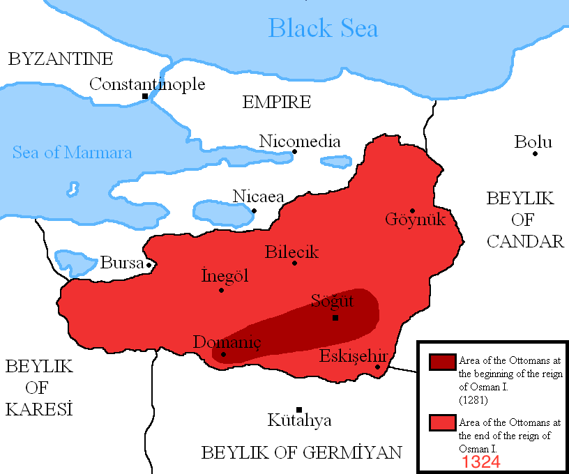
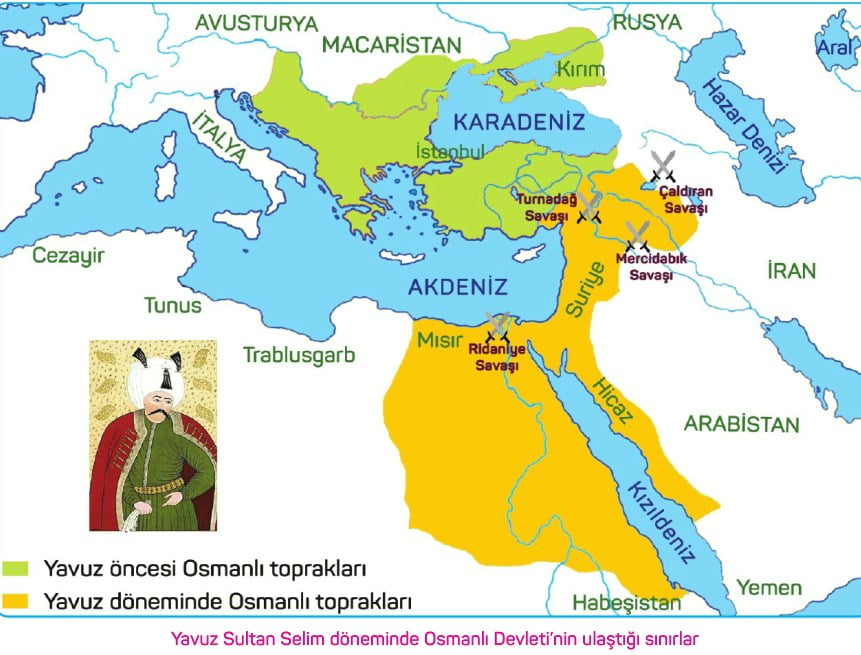
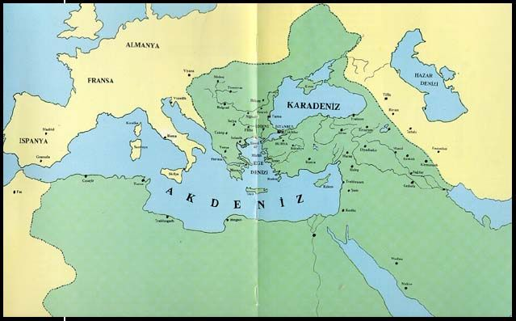

# Osman Bey (1258-1326)

### Onun Zamanında Devletleşmenin Temelleri Atılmıştır

İlk Devlet Parası

İlk Kadı Ataması

İlk Osmanlı Vergisi

Gibi Resmiyet İçeren Kanunlar Yapılması Devletin Ağırlığını Bu Dönemde Ortaya Koyduğunu Göstermektedir

Siyesi Gücünü Güçlendirmek İçin Ahi Şeyh Edebali'nin Kızı İle Evlenmiş Yine Bu Yönde

Oğlu Orhan Beyi Bizans İmparatorunun Kızı İle Evlendirmiştir.

Onun Zamanında Osmanlı Devleti Fetihlerini Neredeyse Hepsini Batıya Doğru Yapmıştır.

Fethettiği Yerler;

Yenişehir 
Yarisar
Bilecik 
Mudurnu 
Karacahisar 
İnegöl

Olarak Sıralanabilir

----------------------------------------------------------------------------------------------------------

# Orhan Bey (1281-1362)

## Onun Döneminde Devlet Olmak Tam Manası İle Gerçekleşmiştir

## 1326 yılında Bursayı Fethetti Ve Başkent Yaptı

## 1329 yılında İznik Fethedildi Ve Geçici Olarak Başkent Yapıldı

Osman Beyden Kalan 16.000 km² Devlet Sınırını 95.000 km² Çıkarmıştır

Onun Döneminde;

İlk kez şehzadeler, bu dönemde sancaklara gönderildi.

İlk defa divan kuruldu.

İlk defa Osmanlı medresesi İznik’te açıldı.

Sancaklara subaşı ve kadı atamaları yapıldı

Osmanlı Devletinin İlk Düzenli Ordusunu Kurdu

Çimpe Kalesi ve Gelibolu kale ve şehrinden başlayarak Bolayır, Keşan ve Rodoscuk (Tekirdağ) 1354'te fethedilmiştir

----------------------------------------------------------------------------------------------------------

# I.Murad (1326-1389)

Onun Döneminde;

Kapıkulu Ocakları kuruldu

Pençik Sistemi uygulanmaya başlandı

Rumeli Beylerbeyliği kuruldu

İlk kez Tımar Sistemi uygulandı ve Tımarlı Sipahiler oluşturuldu

İlk Vezir-i azam atandı. (Çandarlı Halit Paşa)

Ülkenin hanedanın ortak malı anlayışı, “Ülke hükümdar ve oğullarının ortak malıdır.” şeklinde değiştirildi.

Fethettiği Yerler Ve Kazandığı Zaferler;

1360 yılında Karadeniz Ereğlisi’ni fethetti

Ankara ve Sultanönü’nü de 1361 yılında Ahilerden geri aldı

1361 Yılında Çorlu, Keşan, Dimetoka, Pınarhisar, Babaeski, Lüleburgaz kalelerini ve Gümülcine, Eski Zağra ile Yenice dolaylarını fethetti

1362 ylında Edirne’yi aldı ve başkent yaptı

1363 de Bulgaristan’a Girildi

1371 yılında Makedonya Fethedildi

1374 de Selanik Zaferini kazandı

1375 de Niş fethedildi

1382 de İştip, Manastır, Pirlepe alındı

1385 yılında Ohri fethedildi.

----------------------------------------------------------------------------------------------------------

# I.Bayezid (1360-1403 Namı Değer Yıldırım Bayezid)

Döneminde Yaşanan Önemli Olaylar;

Yakup Bey Suikastı (Bayezidin Kardeşi)

Anadolu Seferleri (Diğer Padişahlara Göre Biraz Daha Anadoluda Fetihler Yapmıştır)

Bizansın Kuşatılması

Niğbolu Savaşı

Timur İle Savaş Ve Yenilgi

Ülkedeki Taht Karışıklığı (Timurun Tüm Çocuklarına Sen Padişahsın Demesi İle Ortaya Çıkan Karışıklık)

İç Karışıklıkdan Doğan Fetret Devri (1402-1413)

Döneminde Yapılan Seferler Ve Alınan Yerler;

Selanik ve Mora Yarımadası'nı Osmanlı topraklarına kattı

I. Kosova Savaşı

Yunanistanın Bir Kısmı

Konya Bayşehir

Kastamonu

Amasya

Tokat

Malatya

vs vs.

----------------------------------------------------------------------------------------------------------

# I.Mehmed (1389-1421)

Fetret Devrinden Sonraki İlk Padişahdır

Döneminde Yaşanan Önemli Olaylar;

Osmanlı Devletine Bağlanan Beyliklerin Bir Kısmı Yönetimi Ele Geçirerek Topraklarını Geri Aldı

Saruhanoğulları Beyliğine Son Verildi

Venediklilerle İlk Deniz Savaşı Bu Dönemle Yapıldı

Eflak Berliği Vergiye Bağlanarak Hakimiyetlerine Alındı

Onun Döneminde 2 İsyan Baş Göstermiştir

Bunlar;

Şeyh Bedrettin İsyanı Ve Şehzade Mustafa İsyanı Olarak Söylenebilir.

----------------------------------------------------------------------------------------------------------

# II. Murad (1404-1451)

Dönemindeki Önemli Olaylar;

Venedik'le savaş yapıldı ve Selanik fethedildi

Sırbistan'ın ilhakı

Segedin Antlaşması ve Yenişehir Sevgendnamesi

tahttan çekilmesi 

1444 buhranı ve Varna Muharebesi

Tahta dönüşü

Mora Seferi, İkinci Kosova Savaşı

----------------------------------------------------------------------------------------------------------

# II. Mehmed (1432-1481 Fatih Sultan Mehmet)

Fethettiği Yerler;

İstanbul

Amasra

Sinop 

Sırbistan 

Kırım Hanlığı 

Trabzon 

Arnavutluk 

Karaman

Dönemindeki Önemli Olaylar;

Kardeş Katli Yasası

Çandarlı Halil Paşanın İdamı

Topkapı Dolmabahçe Sarayı Gibi Önemli Yapıların İnşaası

----------------------------------------------------------------------------------------------------------

# II. Bayezid (1447-1512)

Döneminde Yaşanan Önemli Olaylar;

Taht Kavgası (Kardeşi Cem Sultan İle Arasında)

Cem Sultanın Franklar Tarafından Zehirlenmesi

Oğullarının Taht Kavgaları O yaşarken Başlamıştır.

Onun Döneminde Fazla Bir Fetih Veya Savaş Yapılmamıştır, Bayezid Diğer Padişahlara Göre 
Biraz Daha Barış Yancısı Olmuştur.

----------------------------------------------------------------------------------------------------------

# I.Selim (1470-1520 Yavuz Sultan Selim)

Osmanlı Döneminin En Güçlü Zamanlarıdır Hazineyi Ağzına kadar dolduran Tek Hükümdar Olmuştur.

Dönemin Önemli Olayları;

İran İle Savaşlar Seferler Atışmalar Son Raddesine Ulaşmış Ve İrana Sefer Düzenlenmiştir

Mısır Seferi ve Memlük Devleti Ortadan Kaldırılımıştır

Çaldıran Savaşı

Onun Zamanında Osmanlı Devleti 2 Kat Genişlemiş Ve Söylediğimiz Gibi Hazine Ağzına Kadar Dolmuştur.

Döneminin Savaşları;

Mısırın Fethi

Çaldıran Savaşı

Ridaniye Savaşı

Mercidabık Savaşı

Turnadağı Savaşı

Hicaz Bölgesi

Halep

Şam

Lübnan

Filistin

vs vs.

----------------------------------------------------------------------------------------------------------

# Kanuni Sultan Süleyman (1494-1566)

Hazine Boşalmış Fakat İmparatorluk Son Sınırlarına Ulaşmıştır

Dönemin Önemli Olayları;

Mohaç Meydan Muharebesi

Viyana Kuşatması

Rodosun'un Fethi

Mimar Sinan Gibi Büyük İnsanların Bu Döneme Denk Gelmesi

Yaptığı Fetihler Ve Savaşlar;

Belgrad'ın Fethi

Rodos'un Fethi

Mohaç Muharebesi

I. Viyana Kuşatması

Alman Seferi

Irakeyn Seferi

Korfu Seferi

Boğdan Seferi

Budin Kuşatması

Estergon Kuşatması

Nahcivan Seferi

Zigetvar Kuşatması

Not: Sorabileceğiniz Sorulardan Biri Fetihleri Neden Dönemin Önemli Olayları Arasına Koyuduğum Olabilir Bazı Savaşlar O Dönemin Devamını Belirleyecek

Kadar Kritik Olmasından Dolayı Eklenmiştir